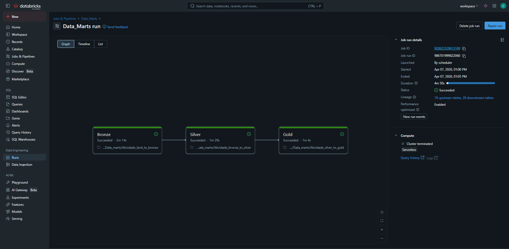

# Pipeline de Dados - Databricks (Arquitetura Medalhão)

Este repositório contém a configuração e a comprovação de execução de um Job no Databricks.

## Configuração do Job (YAML)
O arquivo de configuração detalhado pode ser encontrado em: [Data_Marts.yaml](config/Data_Marts.yaml)

## Print da Execução

